# Bug Report — HW02 Domain Testing on EShop

**Sinh viên:** Lý Quốc Thạnh (23127262) — **SUT:** https://github.com/ttbhanh/eshop-sut
**Tổng:** 16 bug (2 Critical, 8 Major, 6 Minor) — quan sát trực tiếp trên UI.

> **Phạm vi.** Theo chỉ đạo của giảng viên (forum Q&A HW02): *functional testing thực hiện
> từ UI Frontend*. Mọi bug dưới đây đều được **thao tác và quan sát trực tiếp trên giao diện**
> (form Đăng ký của web, trang Checkout của web, app admin `frontend-admin`, app mobile Expo).
>
> **Cách dùng:** mỗi mục dưới đây là 1 GitHub Issue. Tạo issue với **Title** cho sẵn, dán phần
> **Body** vào, kéo-thả ảnh `figures/bugs/bug_x_0N.png` vào issue, rồi điền URL issue vào cột
> **GitHub Issue**. Nhãn (label): `bug`.

> **Đã loại khỏi phạm vi (chỉ chạm được bằng gọi API trực tiếp — không phải functional
> testing từ UI):**
> - Backend không kiểm dữ liệu (đăng ký với body rỗng vẫn thành công).
> - Mật khẩu lưu plaintext và trả về qua `/users/me`.
> - Phân quyền admin ở tầng API (tài khoản user thường CRUD được danh mục khi gọi thẳng API).
> - Giả mạo `user_id` từ client cho `apply-coupon` (endpoint không xác thực token).
> - PUT/DELETE danh mục với id không tồn tại vẫn trả `200`.
> - Mã coupon phân biệt hoa/thường ở backend (UI ép chữ hoa nên không tái hiện được từ giao diện).

---

## Feature A — FR-01 (Đăng ký tài khoản — web, form tại `/register`)

### BUG-A-01 — Mật khẩu mạnh (có ký tự đặc biệt) bị từ chối
- **Title:** `BUG-A-01: Strong password with special char is rejected`
- **Feature:** FR-01 | **Technique:** Domain + BVA | **Severity:** Major
- **Mô tả:** Regex phía client bắt buộc có khoảng trắng và cấm ký tự đặc biệt; mật khẩu mạnh
  đúng đặc tả bị từ chối.
- **Steps to reproduce:**
  1. Mở trang Đăng ký.
  2. Nhập name/email hợp lệ.
  3. Nhập mật khẩu `Password123!`.
  4. Bấm "Đăng Ký".
- **Expected:** Đăng ký thành công, chuyển tới `/login`.
- **Actual:** Báo lỗi "Mật khẩu quá yếu!" ngay dưới form; không đăng ký được.
- **Screenshot:**

  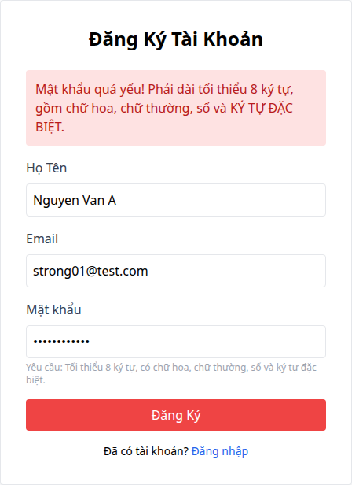
- **GitHub Issue:** https://github.com/dinosauce-285/Software-Testing-G02/issues/1

### BUG-A-02 — Mật khẩu yếu (không có ký tự đặc biệt) được chấp nhận
- **Title:** `BUG-A-02: Weak password without special char is accepted`
- **Feature:** FR-01 | **Technique:** Domain | **Severity:** Major
- **Mô tả:** Mật khẩu chỉ cần có khoảng trắng, không có ký tự đặc biệt vẫn qua regex — trái đặc tả.
- **Steps to reproduce:**
  1. Mở trang Đăng ký.
  2. Nhập name/email hợp lệ.
  3. Nhập mật khẩu `Passw0rd 1` (có khoảng trắng, không ký tự đặc biệt).
  4. Bấm "Đăng Ký".
- **Expected:** Từ chối (thiếu ký tự đặc biệt).
- **Actual:** Đăng ký thành công, chuyển sang `/login`.
- **Screenshot:**

  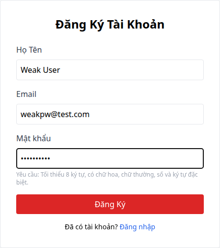
- **GitHub Issue:** https://github.com/dinosauce-285/Software-Testing-G02/issues/2

### BUG-A-03 — Email sai định dạng được chấp nhận
- **Title:** `BUG-A-03: Malformed email is accepted at registration`
- **Feature:** FR-01 | **Technique:** Domain | **Severity:** Major
- **Mô tả:** Trường email dùng `type="text"`, không có kiểm tra định dạng ở UI lẫn backend.
- **Steps to reproduce:**
  1. Mở trang Đăng ký.
  2. Nhập email `notanemail`, mật khẩu `Passw0rd 1`.
  3. Bấm "Đăng Ký".
- **Expected:** Từ chối vì email không hợp lệ.
- **Actual:** Đăng ký thành công, chuyển sang `/login`.
- **Screenshot:**

  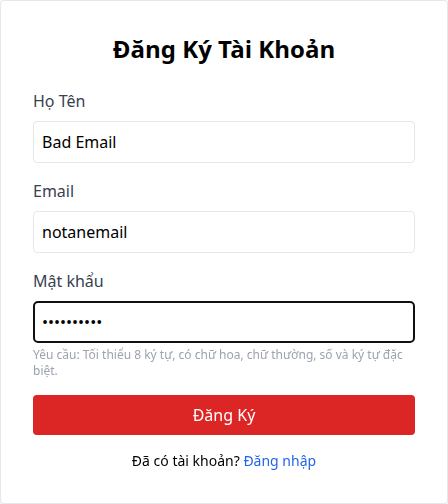
- **GitHub Issue:** https://github.com/dinosauce-285/Software-Testing-G02/issues/3

### BUG-A-04 — Cho phép email trùng lặp
- **Title:** `BUG-A-04: Duplicate email allowed (email column not UNIQUE)`
- **Feature:** FR-01 | **Technique:** Domain | **Severity:** Critical
- **Mô tả:** Cột `email` không `UNIQUE`; đăng ký trùng email tạo bản ghi thứ hai, phá vỡ định
  danh khi đăng nhập.
- **Steps to reproduce:**
  1. Mở trang Đăng ký, nhập `test@eshop.com` (đã tồn tại) + mật khẩu hợp lệ, bấm "Đăng Ký".
  2. Đăng nhập app admin, mở tab "Người dùng".
  3. Quan sát danh sách.
- **Expected:** Form từ chối vì email đã tồn tại.
- **Actual:** Form không báo lỗi, chuyển sang `/login`; tab "Người dùng" hiển thị *hai* tài
  khoản cùng email `test@eshop.com`.
- **Screenshot:**

  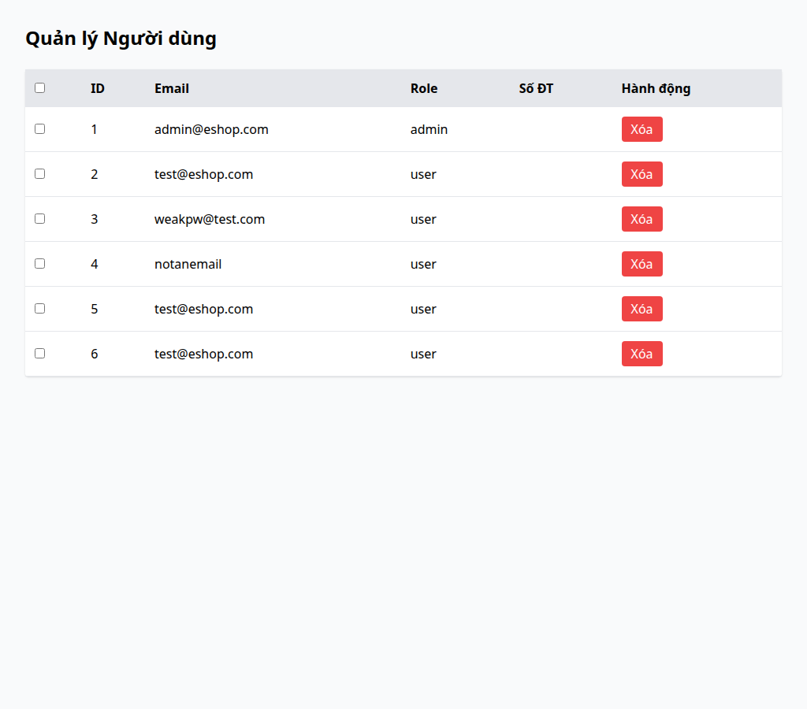
- **GitHub Issue:** https://github.com/dinosauce-285/Software-Testing-G02/issues/4

---

## Feature B — FR-09 (Mã giảm giá — web, trang Checkout)

### BUG-B-01 — Mã giảm giá phần trăm tính sai, làm tăng giá ~10 lần
- **Title:** `BUG-B-01: Percent coupon math inflates order total ~10x`
- **Feature:** FR-09 | **Technique:** Domain | **Severity:** Critical
- **Mô tả:** Công thức `floor(total_amount × (1 − discount_value))` sai: `discount_value` là số
  nguyên (10 = 10%), khiến "Tiết kiệm" âm và "Thành tiền" lớn gấp ~10 lần đơn gốc.
- **Steps to reproduce:**
  1. Ở trang Checkout, thêm hàng để tổng = 400.000.
  2. Nhập mã `SAVE10`.
  3. Bấm "Áp dụng".
- **Expected:** Giảm 40.000, còn 360.000.
- **Actual:** Màn hình hiện "Tiết kiệm −3.600.000 ₫", "Thành tiền 4.000.000 ₫" — đắt gấp 10 lần.
- **Screenshot:**

  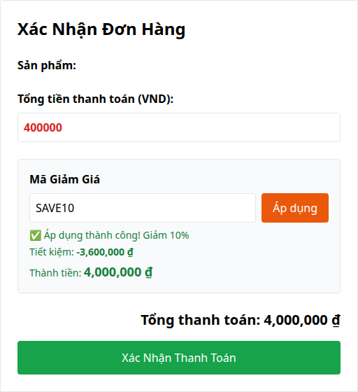
- **GitHub Issue:** https://github.com/dinosauce-285/Software-Testing-G02/issues/5

### BUG-B-02 — Đơn bằng đúng mức tối thiểu bị từ chối (off-by-one)
- **Title:** `BUG-B-02: Order exactly at min_order_amount rejected (off-by-one)`
- **Feature:** FR-09 | **Technique:** BVA | **Severity:** Minor
- **Mô tả:** Điều kiện `total_amount > min_order_amount` dùng `>` thay vì `>=`; đơn bằng đúng
  mức tối thiểu bị từ chối.
- **Steps to reproduce:**
  1. Ở trang Checkout, đặt tổng đơn = 300.000.
  2. Nhập mã `VIP100` (min 300.000).
  3. Bấm "Áp dụng".
- **Expected:** Chấp nhận (đơn đủ mức tối thiểu), Thành tiền 200.000.
- **Actual:** Báo lỗi đỏ "Đơn hàng chưa đủ giá trị tối thiểu…" dù đơn bằng đúng mức.
- **Screenshot:**

  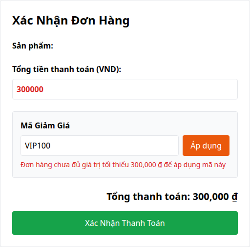
- **GitHub Issue:** https://github.com/dinosauce-285/Software-Testing-G02/issues/6

### BUG-B-03 — Khách (guest) không bị giới hạn số lần dùng mã
- **Title:** `BUG-B-03: Guest checkout bypasses max_uses_per_user`
- **Feature:** FR-09 | **Technique:** Domain | **Severity:** Major
- **Mô tả:** Khi *không đăng nhập*, trang Checkout gửi `user_id` rỗng; kiểm tra
  `max_uses_per_user` chỉ chạy khi có `user_id` nên khách vãng lai áp cùng một mã không giới
  hạn số lần.
- **Steps to reproduce:**
  1. *Không* đăng nhập, vào trang Checkout.
  2. Nhập `VIP100` và bấm "Áp dụng" nhiều lần liên tiếp.
- **Expected:** Bị chặn theo `max_uses_per_user`.
- **Actual:** Mã luôn áp dụng được cho khách, không lần nào bị chặn.
- **Screenshot:**

  
- **GitHub Issue:** https://github.com/dinosauce-285/Software-Testing-G02/issues/7

### BUG-B-04 — Không chặn "Thành tiền" âm với mã fixed
- **Title:** `BUG-B-04: final total not clamped ≥ 0 for fixed coupons`
- **Feature:** FR-09 | **Technique:** BVA | **Severity:** Minor
- **Mô tả:** Với mã `fixed`, số tiền giảm không bị kẹp theo tổng đơn; nếu mức giảm lớn hơn đơn,
  "Thành tiền" hiển thị số *âm* (không kẹp ≥ 0).
- **Steps to reproduce:**
  1. Đăng nhập app admin, tab "Mã Giảm Giá", tạo mã fixed `discount=100.000, min=50.000`, còn hạn.
  2. Ra web, vào trang Checkout, đặt Tổng tiền `60.000` (> min).
  3. Nhập mã vừa tạo, bấm "Áp dụng".
- **Expected:** "Thành tiền" được kẹp ≥ 0 và hợp lý.
- **Actual:** "Thành tiền" hiển thị −40.000 ₫ (âm, không kẹp).
- **Screenshot:**

  
- **GitHub Issue:** https://github.com/dinosauce-285/Software-Testing-G02/issues/8

---

## Feature C — FR-14 (Quản lý danh mục — app admin `frontend-admin`, tab "Danh mục", chỉ có Thêm/Xóa)

### BUG-C-01 — Ô "Tên danh mục" chấp nhận tên rỗng / chỉ khoảng trắng
- **Title:** `BUG-C-01: Category name field accepts empty / whitespace-only value`
- **Feature:** FR-14 | **Technique:** Domain + BVA | **Severity:** Major
- **Mô tả:** Form "Thêm mới" (tab Danh mục) không kiểm tra ô nhập: để trống hoặc chỉ gõ khoảng
  trắng rồi bấm Thêm vẫn tạo một danh mục tên rỗng, hiển thị thành hàng trống trong bảng.
- **Steps to reproduce:**
  1. Đăng nhập admin, mở tab "Danh mục".
  2. Để trống ô "Tên danh mục mới" (hoặc gõ `"   "`), bấm "Thêm mới".
  3. Quan sát bảng danh mục.
- **Expected:** Chặn và báo lỗi; không tạo danh mục tên rỗng.
- **Actual:** Một hàng danh mục mới với ô Tên trống xuất hiện trong bảng.
- **Screenshot:**

  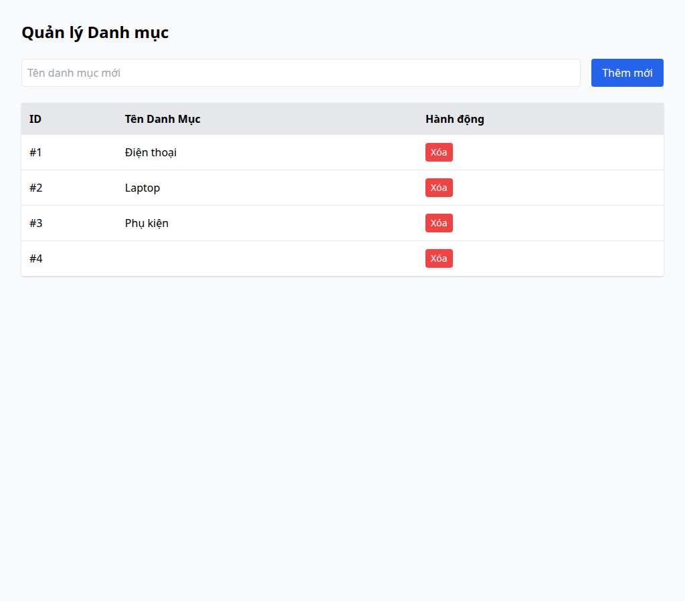
- **GitHub Issue:** https://github.com/dinosauce-285/Software-Testing-G02/issues/9

### BUG-C-02 — Cho phép thêm tên danh mục trùng lặp
- **Title:** `BUG-C-02: Duplicate category name allowed`
- **Feature:** FR-14 | **Technique:** Domain | **Severity:** Minor
- **Mô tả:** Thêm một danh mục có tên trùng danh mục đã tồn tại vẫn thành công (không cảnh báo),
  tạo hai hàng cùng tên trong bảng, gây nhập nhằng khi chọn danh mục cho sản phẩm.
- **Steps to reproduce:**
  1. Đăng nhập admin, tab "Danh mục".
  2. Nhập "Laptop" (đã có sẵn) rồi bấm "Thêm mới".
  3. Quan sát bảng có hai hàng "Laptop".
- **Expected:** Từ chối vì tên đã tồn tại.
- **Actual:** Bảng hiển thị hai danh mục cùng tên "Laptop".
- **Screenshot:**

  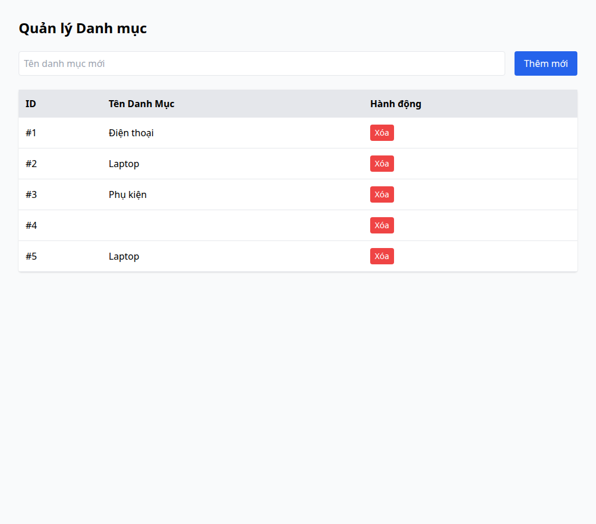
- **GitHub Issue:** https://github.com/dinosauce-285/Software-Testing-G02/issues/10

### BUG-C-03 — Xóa danh mục đang có sản phẩm làm sản phẩm mồ côi
- **Title:** `BUG-C-03: Deleting a category orphans its products`
- **Feature:** FR-14 | **Technique:** Domain | **Severity:** Major
- **Mô tả:** Nút "Xóa" xóa ngay danh mục kể cả khi danh mục đang có sản phẩm, không cảnh báo cũng
  không di chuyển sản phẩm; các sản phẩm liên quan trở thành "mồ côi" (trỏ tới danh mục không
  còn tồn tại).
- **Steps to reproduce:**
  1. Đăng nhập admin, tab "Danh mục".
  2. Bấm "Xóa" ở danh mục "Điện thoại" (đang có 2 sản phẩm).
  3. Sang tab "Sản phẩm" xem các sản phẩm thuộc danh mục vừa xóa.
- **Expected:** Chặn/cảnh báo khi danh mục còn sản phẩm, hoặc di chuyển sản phẩm.
- **Actual:** Danh mục biến mất ngay; các sản phẩm vẫn còn nhưng thuộc danh mục không còn tồn
  tại (mồ côi).
- **Screenshot:**

  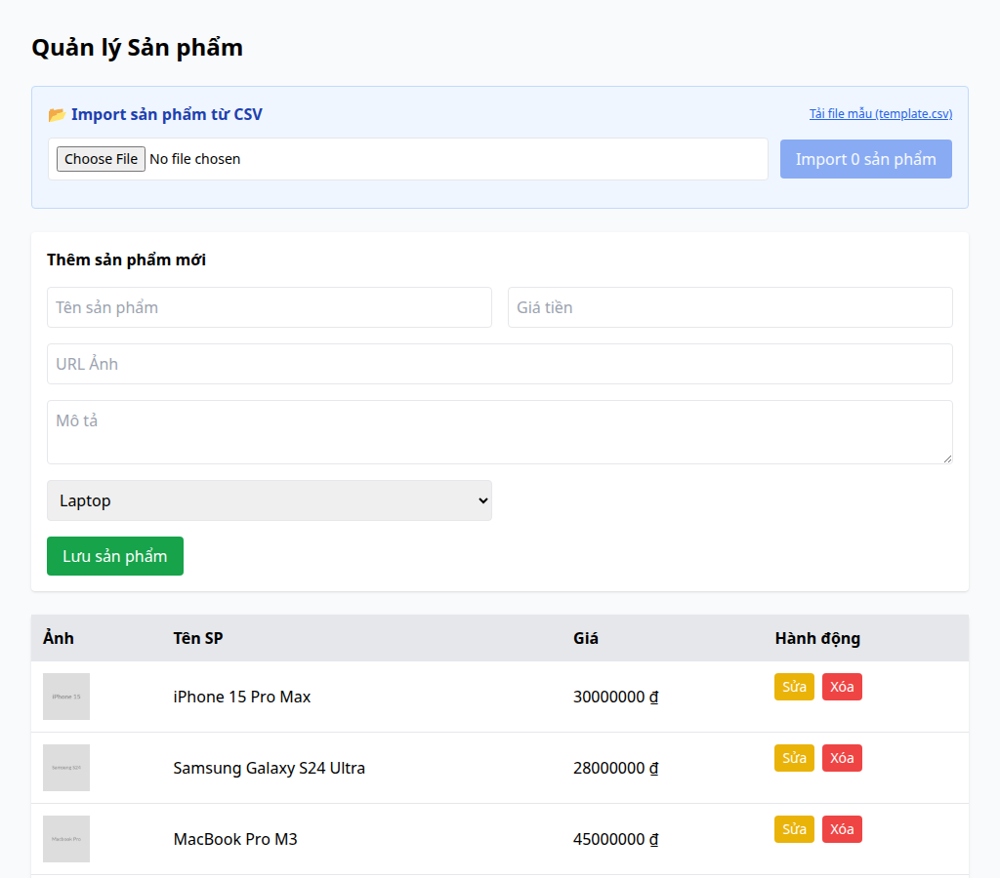
- **GitHub Issue:** https://github.com/dinosauce-285/Software-Testing-G02/issues/11

### BUG-C-04 — Ô "Tên danh mục" không giới hạn độ dài
- **Title:** `BUG-C-04: Category name field has no length limit`
- **Feature:** FR-14 | **Technique:** BVA | **Severity:** Minor
- **Mô tả:** Ô nhập tên không có ràng buộc độ dài tối đa; dán một tên cực dài (hàng nghìn ký tự)
  vẫn thêm được, làm vỡ bố cục bảng danh mục và tiềm ẩn rủi ro lưu trữ.
- **Steps to reproduce:**
  1. Đăng nhập admin, tab "Danh mục".
  2. Dán chuỗi ≈5.000 ký tự vào ô "Tên danh mục mới", bấm "Thêm mới".
  3. Quan sát hàng mới trong bảng.
- **Expected:** Giới hạn độ dài hợp lý / từ chối khi vượt.
- **Actual:** Danh mục được tạo với toàn bộ chuỗi, hiển thị tràn trong bảng.
- **Screenshot:**

  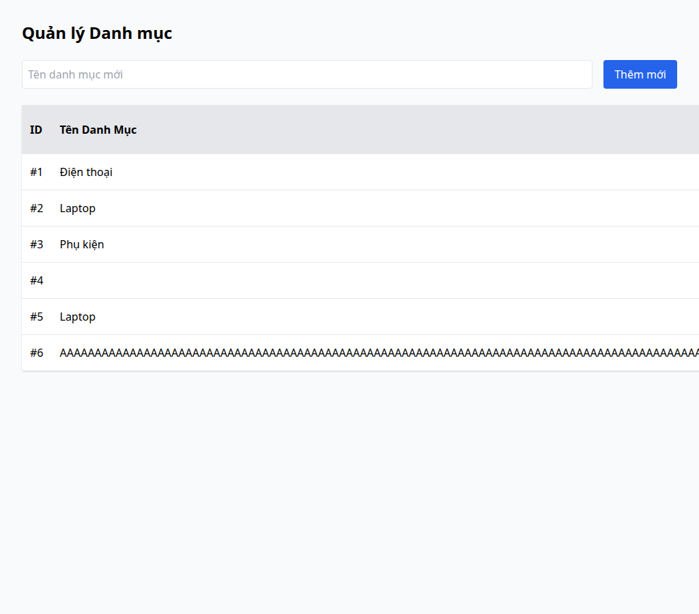
- **GitHub Issue:** https://github.com/dinosauce-285/Software-Testing-G02/issues/12

---

## Feature D — FR-07 (Giỏ hàng — app mobile Expo, app chính là UI)

### BUG-D-01 — Sửa số lượng trong giỏ bị cộng thêm 1 (off-by-one)
- **Title:** `BUG-D-01: Cart quantity edit stores parsed+1 (off-by-one)`
- **Feature:** FR-07 (Mobile) | **Technique:** Domain + BVA | **Severity:** Major
- **Mô tả:** Handler `onChangeText` của ô số lượng trong giỏ đặt `quantity = parsed + 1`; nhập N
  thì lưu N+1, làm sai số lượng và tổng tiền mỗi lần sửa.
- **Steps to reproduce:**
  1. Thêm 1 sản phẩm vào giỏ.
  2. Mở giỏ, sửa ô số lượng thành `2`.
  3. Quan sát số lượng/thành tiền.
- **Expected:** Số lượng = 2.
- **Actual:** Ô số lượng nhảy thành 3, "Thành tiền" tính theo 3.
- **Screenshot:**

  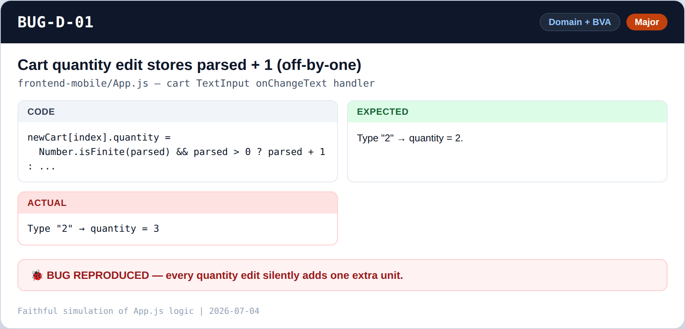
- **GitHub Issue:** https://github.com/dinosauce-285/Software-Testing-G02/issues/13

### BUG-D-02 — Checkout bỏ mất món cuối nhưng vẫn tính đủ tiền
- **Title:** `BUG-D-02: Checkout drops last cart item but still charges full total`
- **Feature:** FR-07 (Mobile) | **Technique:** Domain + BVA | **Severity:** Major
- **Mô tả:** `handleConfirmCheckout` gửi `items = cart.length > 1 ? cart.slice(0,-1) : cart` — bỏ
  món cuối khi giỏ có >1 món, trong khi `total_amount` vẫn bằng `cartTotal` (tính đủ mọi món).
  Đơn ghi thiếu món nhưng khách trả đủ tiền.
- **Steps to reproduce:**
  1. Thêm 3 sản phẩm khác nhau vào giỏ (màn giỏ hiện 3 món, tổng của 3).
  2. Bấm Thanh toán, rồi Xác nhận.
- **Expected:** Đơn đặt gồm đủ 3 món, khớp số tiền đã thu.
- **Actual:** App gửi chỉ 2 món (bỏ món cuối) nhưng vẫn thu tiền của cả 3; app không có màn chi
  tiết đơn nên sai lệch bị che khuất (vùng xám).
- **Screenshot:**

  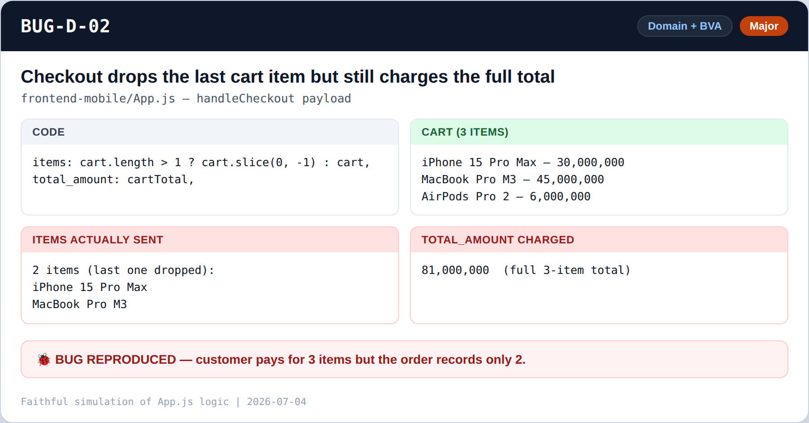
- **GitHub Issue:** https://github.com/dinosauce-285/Software-Testing-G02/issues/14

### BUG-D-03 — Số lượng không hợp lệ bị âm thầm ép về 1
- **Title:** `BUG-D-03: Invalid quantity silently coerced to 1`
- **Feature:** FR-07 (Mobile) | **Technique:** Domain | **Severity:** Minor
- **Mô tả:** `normalizeQuantity` dùng `parseInt` và ép mọi giá trị không hợp lệ (0, âm, chữ) về
  `1`; số thập phân bị cắt (`"2.9"`→2) — không báo cho người dùng biết đầu vào đã bị thay đổi.
- **Steps to reproduce:**
  1. Trang chi tiết sản phẩm, nhập số lượng `0` (hoặc `-2`, `abc`, `2.9`).
  2. Thêm vào giỏ.
- **Expected:** Báo lỗi/không cho thêm với số lượng không hợp lệ.
- **Actual:** Giỏ âm thầm hiện số lượng 1 (hoặc phần nguyên), không cảnh báo.
- **Screenshot:**

  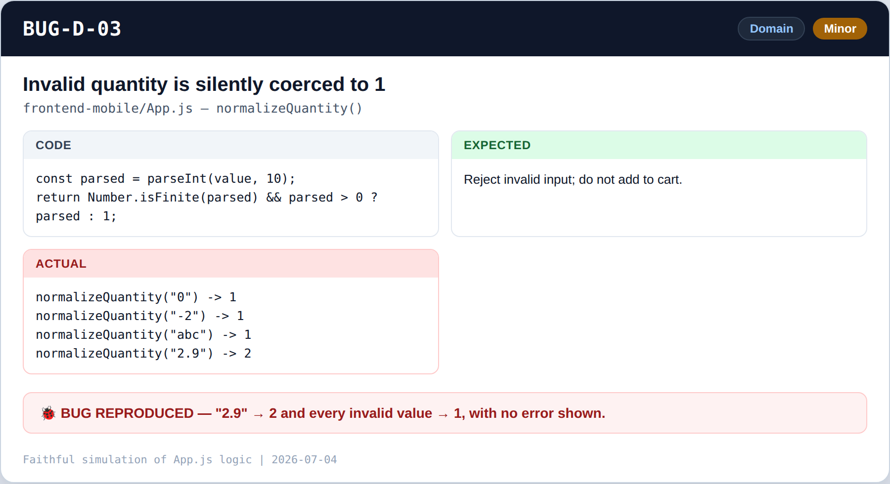
- **GitHub Issue:** https://github.com/dinosauce-285/Software-Testing-G02/issues/15

### BUG-D-04 — Không giới hạn số lượng / không kiểm tồn kho
- **Title:** `BUG-D-04: No max quantity / stock limit`
- **Feature:** FR-07 (Mobile) | **Technique:** BVA | **Severity:** Minor
- **Mô tả:** Không có biên trên cho số lượng và không có mô hình tồn kho; có thể thêm số lượng
  cực lớn (vd `999999`) vào giỏ, tạo tổng tiền phi lý.
- **Steps to reproduce:**
  1. Trang chi tiết sản phẩm, nhập số lượng `999999`.
  2. Thêm vào giỏ, xem tổng.
- **Expected:** Giới hạn theo tồn kho / mức tối đa hợp lý.
- **Actual:** Giỏ nhận toàn bộ, "Thành tiền" hiện số cực lớn phi lý.
- **Screenshot:**

  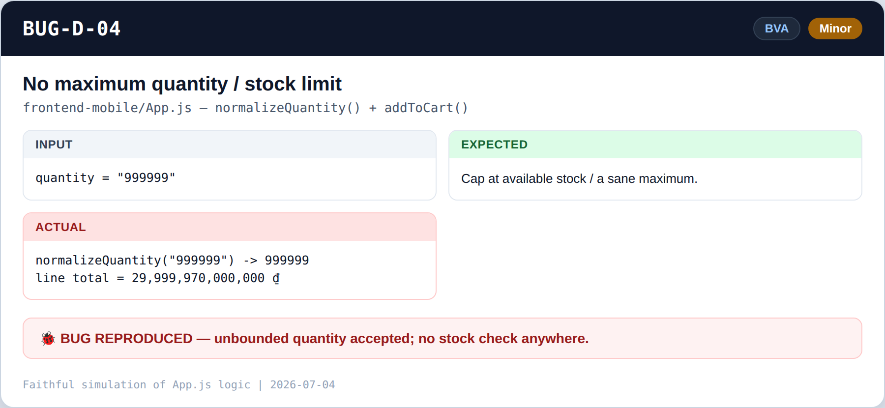
- **GitHub Issue:** https://github.com/dinosauce-285/Software-Testing-G02/issues/16
